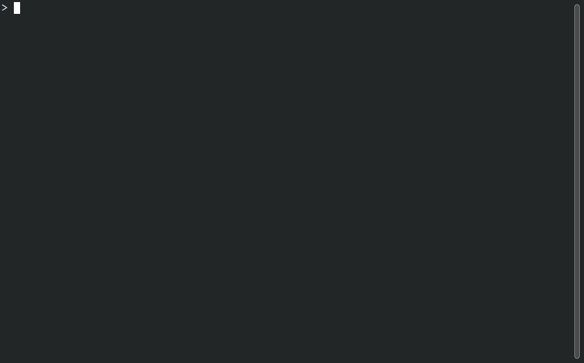

[](https://github.com/terminationshock/lisst/actions/workflows/build_and_test.yml)
[](https://build.opensuse.org/package/show/home:terminationshock/lisst)
[](LICENSE)
[](https://go.dev/dl/)

# lisst

This tools reads from stdin and displays the input as a list. Each line is matched
against a regular expression. Lines can be selected interactively to execute commands built
upon selected matches.



## Usage

The usage of *lisst* can best be explained with an example:

```bash
git log --oneline | lisst "[0-9a-f]{7,40}" git show
```

This command will pipe the output of `git log` into *lisst*. It will open an interactive list which you can browse with the arrow keys.
Each commit hash matching the regular expression `[0-9a-f]{7,40}` will be highlighted. When you select a line containing a commit hash
and hit the enter key, the command `git show <commit hash>` will be executed. When this command returns, the list will be shown again allowing you
to select the next line of interest.

The main advantage of *lisst* is its ability to interactively select lines. Often a combination of `grep` and `xargs` can achieve a somewhat similar
effect, but much less convenient. The following command, for example, will also run `git show` for all commits, however, one after the other, which
is typically not very useful:

```bash
git log --oneline | grep -E "[0-9a-f]{7,40}" -o | xargs -L 1 -p git show
```

*lisst* accepts all non-empty output piped into it and splits it on line breaks. Each line is matched against the given regular expression.
The first match within a line is highlighted. The enter key triggers the upstream command only if the selected line contains a match.
An arbitrary number of command line arguments can be added to the command. The highlighted match in the selected line is appended
to this list of arguments. The status bar at the bottom displays the command that is about to be executed when the enter key is pressed.

The following example demonstrates how to efficiently edit many files:

```bash
grep -r func | lisst "^(.*?):" vi
```

All occurrences of `func` in all files in the current directory and all sub-directories will be displayed as a list with each file name being highlighted.
When you select a certain line and press the enter key, the editor `vi` will be launched and you can edit the file as usual. When you close the editor,
the list will be visible again allowing you to edit the next file.

You can use human-readable keywords for frequently used patterns. In the screencast shown above, for example,
the keyword `--git-commit-hash` is used for convenience instead of the actual regular expression.
See `lisst --help` for a complete list of supported keywords and more useful examples.

## Installation

You can download prebuilt binaries of *lisst* [here](https://github.com/terminationshock/lisst/releases/latest).
If you work with *bash*, you might want to include the corresponding bash completion:
```bash
source bash_completion.sh
```

On OpenSUSE, you can alternatively install *lisst* as a package.

### OpenSUSE Leap 15.5 or later

Replace `<Leap version>` below:

```bash
zypper addrepo --refresh https://download.opensuse.org/repositories/home:/terminationshock/<Leap version>/ terminationshock
zypper install lisst
```

### OpenSUSE Tumbleweed

```bash
zypper addrepo --refresh https://download.opensuse.org/repositories/home:/terminationshock/openSUSE_Tumbleweed/ terminationshock
zypper install lisst
```

## Building

You can build the executable yourself by running `make`. It requires Go version 1.19 or later for building.

## Testing

The tests (unit and integration tests) can be run with `make check`.

## License

*lisst* is licensed under the [MIT License](LICENSE).

## Licenses of dependencies

*lisst* depends on several other Go packages. Their licenses are listed [here](LICENSES_DEPENDENCIES.md).
